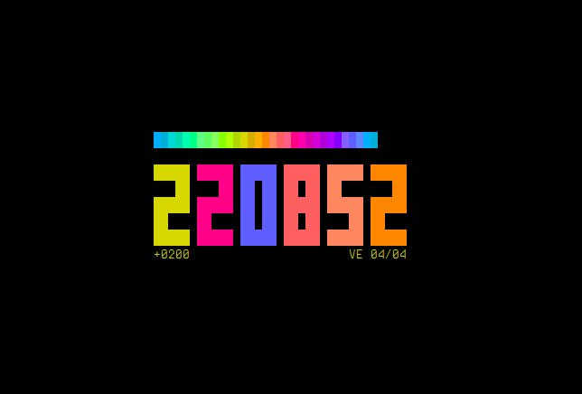

# ALGORLOGE

Une horloge écrite en **FR-ALGO**.

## Dépendences

* [FR-ALGO v0.12.0.beta.2](https://github.com/teegre/fr-algo/releases/tag/v0.12.0.beta.2)
* Librairie standard [https://github.com/teegre/fr-algo-std](https://github.com.teegre/fr-algo-std).
